# HirePrep AI

An AI-driven, full-stack interview preparation platform that transforms raw resumes and job descriptions into actionable career strategies. Built on the MERN stack with Google Gemini integration.

## Table of Contents

- [Overview](#overview)
- [Core Capabilities](#core-capabilities)
- [High-Level Architecture](#high-level-architecture)
- [Tech Stack](#tech-stack)
- [Getting Started](#getting-started)
  - [Prerequisites](#prerequisites)
  - [Installation](#installation)
  - [Environment Configuration](#environment-configuration)
  - [Running the Application](#running-the-application)
- [Backend](#backend)
  - [Server Entry Point](#server-entry-point)
  - [Application Wiring](#application-wiring)
  - [Authentication System](#authentication-system)
  - [Interview Report Pipeline](#interview-report-pipeline)
  - [AI Service (Google Gemini Integration)](#ai-service-google-gemini-integration)
  - [Job Search Service](#job-search-service)
  - [Database & Data Models](#database--data-models)
- [Frontend](#frontend)
  - [Application Entry Point](#application-entry-point)
  - [Routing & Application Shell](#routing--application-shell)
  - [Authentication Feature](#authentication-feature)
  - [Interview Feature](#interview-feature)
  - [Public Landing Page](#public-landing-page)
  - [Styling System](#styling-system)
- [API Reference](#api-reference)
  - [Auth Endpoints (`/api/auth`)](#auth-endpoints-apiauth)
  - [Interview Endpoints (`/api/interview`)](#interview-endpoints-apiinterview)
  - [Job Search Endpoint (`/api/jobs`)](#job-search-endpoint-apijobs)
- [Glossary](#glossary)

---

## Overview

HirePrep AI is a full-stack, AI-driven interview preparation platform designed to transform raw resumes and job descriptions into actionable career strategies. By leveraging Large Language Models (LLMs), the system automates deep resume analysis, generates tailored technical and behavioral interview questions, provides structured study roadmaps, and fetches live job opportunities.

## Core Capabilities

- **Deep Resume Analysis** — Extracts experience and skills from PDF uploads to map against job requirements.
- **Targeted Strategy** — Generates custom-tailored interview answers based on specific company cultures and candidate backgrounds.
- **Instant Roadmaps** — Creates day-by-day preparation plans using structured AI output.
- **AI Job Matcher** — Derives optimized search queries from user profiles to find live listings via external APIs.

---

## High-Level Architecture

The project follows a classic three-tier architecture using the MERN stack (MongoDB, Express, React, Node.js) with integrated AI services.

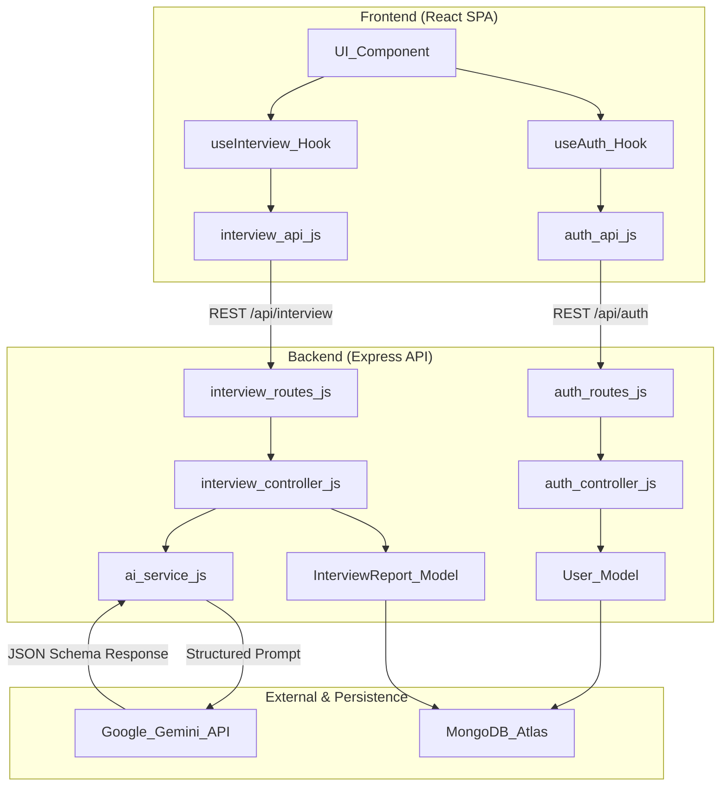

### User Journey

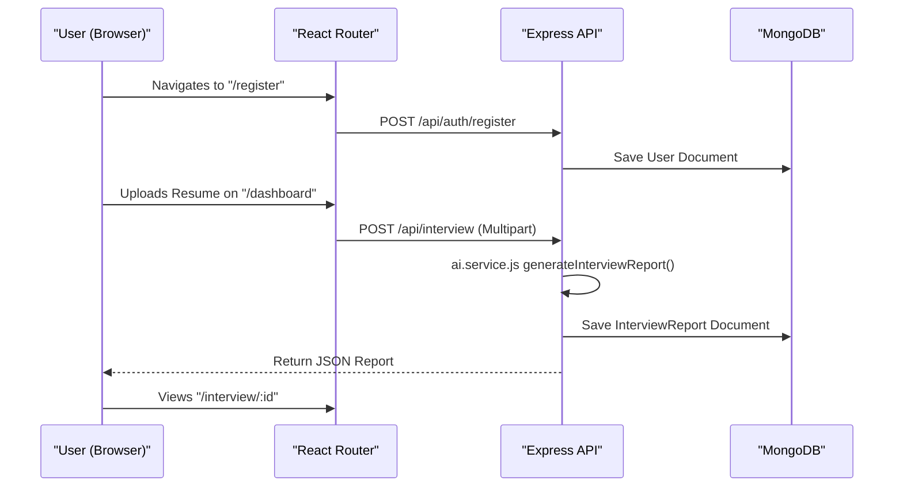

---

## Tech Stack

| Layer | Technologies |
| :--- | :--- |
| **Frontend** | React 19, Vite, React Router v7, Axios, SCSS (Glassmorphism) |
| **Backend** | Node.js, Express 5, Multer, PDF-Parse, Zod |
| **Database** | MongoDB, Mongoose |
| **AI/External** | Google Generative AI (Gemini), Puppeteer (PDF Gen), JSearch API (RapidAPI) |

---

## Getting Started

### Prerequisites

- Node.js (v18+)
- npm
- A MongoDB Atlas instance (or local MongoDB)
- Google Gemini API Key
- RapidAPI Key (for JSearch)

### Installation

```bash
# Clone the repository
git clone https://github.com/harshitzofficial/HirePrep-AI.git
cd HirePrep-AI

# Install backend dependencies
cd Backend
npm install

# Install frontend dependencies
cd ../Frontend
npm install
```

### Environment Configuration

Create `.env` files in both the `Backend/` and `Frontend/` directories. These files are excluded from version control via `.gitignore`.

#### Backend (`Backend/.env`)

| Variable | Description |
| :--- | :--- |
| `PORT` | The port on which the Express server runs (Default: `3000`). |
| `MONGO_URI` | Connection string for MongoDB Atlas or local instance. |
| `JWT_SECRET` | Secret key used for signing JSON Web Tokens. |
| `GOOGLE_GENAI_API_KEY` | API Key for Google Gemini integration. |
| `RAPIDAPI_KEY` | Key for JSearch API via RapidAPI for live job fetching. |

#### Frontend (`Frontend/.env`)

| Variable | Description |
| :--- | :--- |
| `VITE_API_URL` | The base URL of the running backend (e.g., `http://localhost:3000/api`). |

### Running the Application

```bash
# Start the backend (from Backend/ directory)
npm run dev

# Start the frontend (from Frontend/ directory)
npm run dev
```

The backend server entry point is `server.js`, which initializes the Express application defined in `src/app.js`. The frontend is served via Vite and mounts the React application into the `div#root` element.

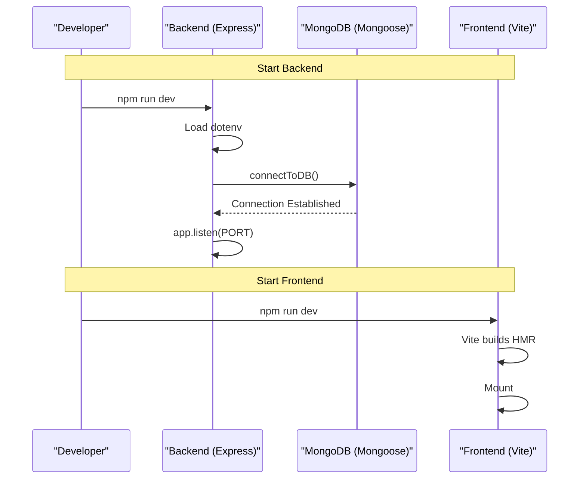

---

## Backend

The backend is a Node.js application built with Express. It serves as the central orchestration layer, connecting the React frontend to MongoDB for persistence and external services like Google Gemini AI and JSearch RapidAPI.

### Server Entry Point

The application execution begins at `Backend/server.js`:

| Component | Responsibility |
| :--- | :--- |
| `dotenv` | Loads environment variables (`PORT`, `MONGO_URI`, etc.) |
| `connectToDB` | Initializes the Mongoose connection to MongoDB |
| `app.listen` | Starts the server on the specified `PORT` (default 3000) |

### Application Wiring

Core application logic and middleware configuration reside in `Backend/src/app.js`:

**Global Middlewares:**
- `express.json()` — Parses incoming JSON payloads.
- `cookieParser()` — Parses Cookie headers for JWT-based authentication.
- `cors()` — Configured to allow requests from `http://localhost:5173` with `credentials: true`.

**Route Mounting:**
- `/api/auth` — User lifecycle management.
- `/api/interview` — Resume analysis and report generation.
- `/api/jobs` — AI-driven job searching.

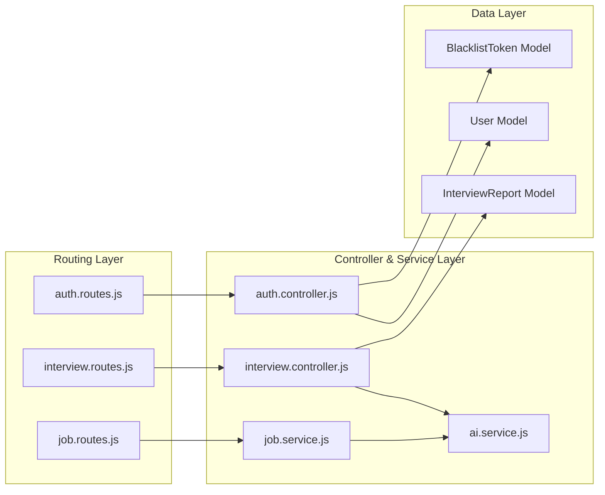

---

### Authentication System

The authentication system provides a secure, cookie-based session management flow using JWT, `bcryptjs` for password hashing, and a database-backed blacklist for token invalidation.

#### Authentication Lifecycle

1. **Registration** — New users provide `username`, `email`, and `password`. The password is hashed with a salt factor of 10 before persistence.
2. **Login** — Credentials are verified using `bcrypt.compare`. On success, a JWT is signed (1-day expiry) containing the user's ID and username.
3. **Session Management** — Tokens are issued via `res.cookie("token", token)` as HTTP-only cookies. The `authUser` middleware extracts and validates this cookie on protected routes.
4. **Logout & Blacklisting** — On logout, the token is saved to the `tokenBlacklistModel` and the cookie is cleared.

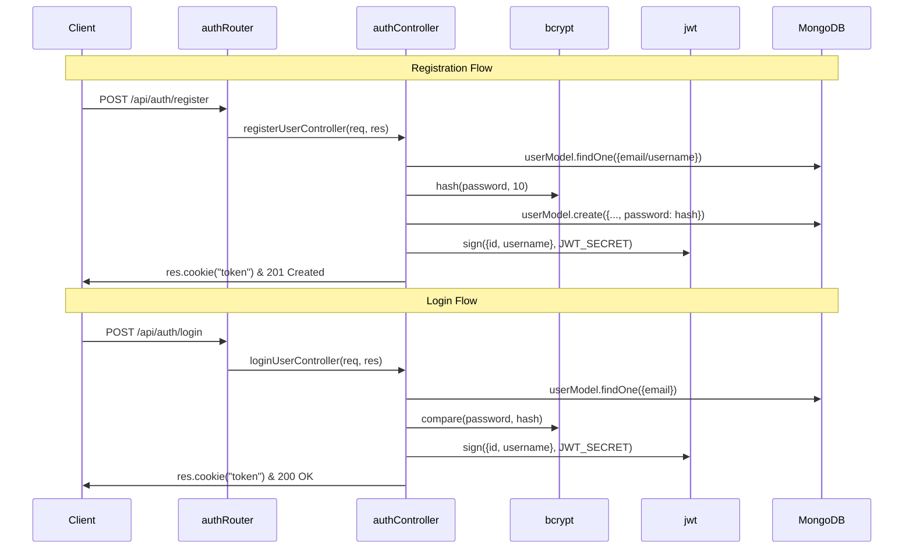

#### Security Middleware (`authUser`)

The middleware performs a three-step validation:
1. **Extraction** — Retrieves the token from `req.cookies.token`.
2. **Blacklist Check** — Queries `tokenBlacklistModel` to ensure the token hasn't been invalidated.
3. **Verification** — Uses `jwt.verify` with `JWT_SECRET` to validate signature and expiration.

Upon success, the decoded payload is attached to `req.user`.

---

### Interview Report Pipeline

The pipeline transforms raw candidate data (PDF resume, job description, self-description) into a structured, AI-generated preparation report.

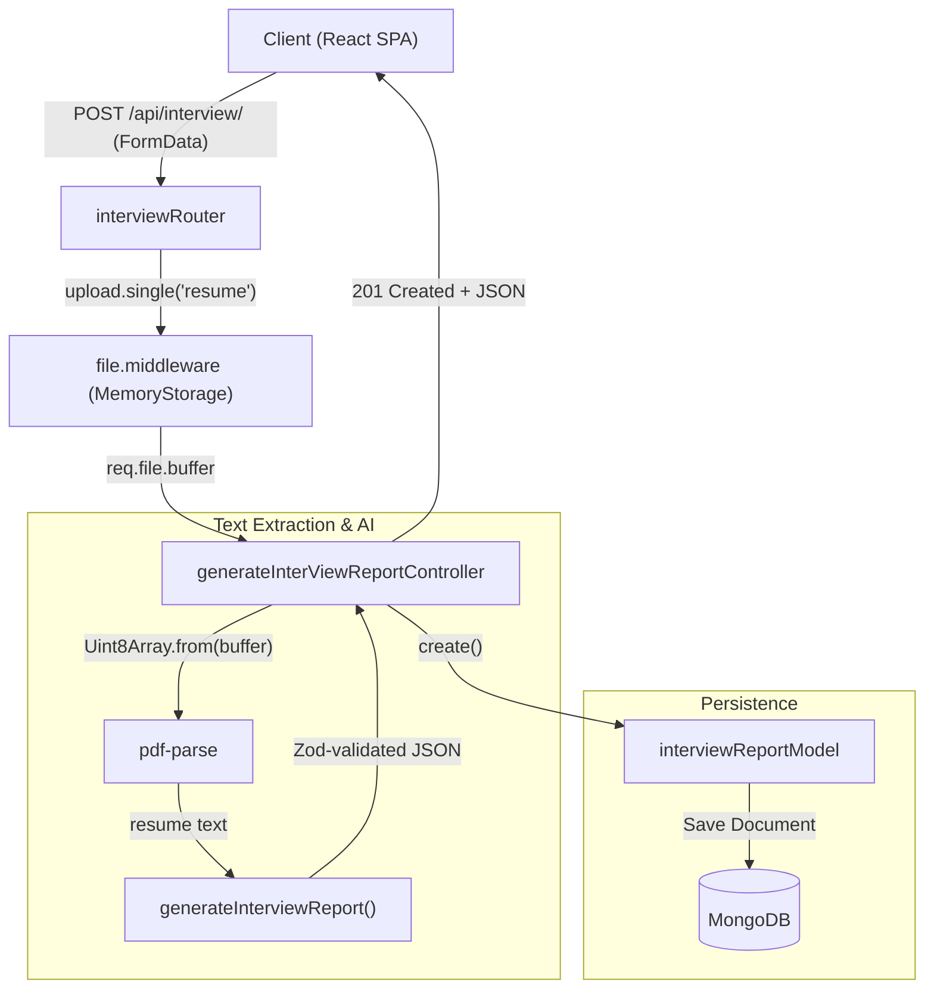

#### Key Components

1. **File Ingestion (Multer)** — Uses `multer.memoryStorage()` to keep the uploaded PDF in a buffer. Enforces a 3MB file size limit.
2. **Text Extraction (pdf-parse)** — Converts `req.file.buffer` into a `Uint8Array` and extracts raw text.
3. **AI Generation & Schema Enforcement** — Extracted text + descriptions are passed to `generateInterviewReport` which uses Zod-enforced schemas with Google Gemini.
4. **Data Persistence (Mongoose)** — Results are merged with input data and user ID to create a new `InterviewReport` document.

#### Retrieval Logic

- **List All** — `getAllInterviewReportsController` retrieves reports sorted by creation date, excluding heavy text fields for dashboard optimization.
- **Single Report** — `getInterviewReportByIdController` fetches the full document, ensuring the `user` ID matches the authenticated requester.

---

### AI Service (Google Gemini Integration)

The AI Service layer (`Backend/src/services/ai.service.js`) is the core intelligence engine. It uses **Zod** for schema definition and **zod-to-json-schema** to enforce strict JSON output from the Gemini API.

#### Interview Report Schema

| Field | Type | Description |
| :--- | :--- | :--- |
| `matchScore` | Number | A 0-100 score matching candidate to job description |
| `technicalQuestions` | Array | Questions, interviewer intentions, and model answers |
| `behavioralQuestions` | Array | Soft-skill questions with suggested approaches |
| `skillGaps` | Array | Missing skills with severity levels (low/medium/high) |
| `preparationPlan` | Array | Day-wise roadmap (day, focus, tasks) |
| `title` | String | The specific job title for the report |

#### Report Generation Flow

1. **Prompt Construction** — Combines `resume`, `selfDescription`, and `jobDescription` into a single prompt.
2. **Schema Enforcement** — `zodToJsonSchema` converts the Zod object into a JSON schema for Gemini's `responseSchema`.
3. **API Call** — Invokes `ai.models.generateContent` with `responseMimeType: "application/json"`.
4. **Parsing** — Validates and parses the AI's response into a JavaScript object.

#### Resume PDF Generation Pipeline

A two-step process for generating ATS-friendly resumes:

1. **HTML Generation (`generateResumePdf`)** — Prompts Gemini to generate professional, ATS-friendly HTML.
2. **PDF Rendering (`generatePdfFromHtml`)** — Uses **Puppeteer** to convert HTML into a binary PDF buffer (A4 format, custom margins).

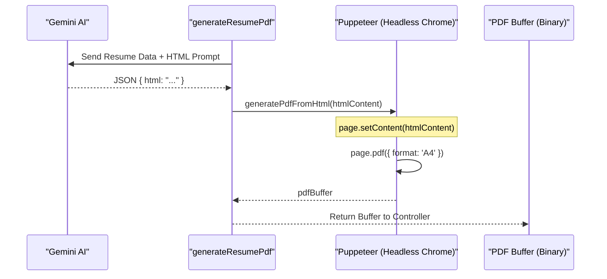

#### Key Functions

| Function | Input | Output | Role |
| :--- | :--- | :--- | :--- |
| `generateInterviewReport` | `resume`, `selfDescription`, `jobDescription` | Structured Report Object | Primary AI analysis for interview prep |
| `generateResumePdf` | `resume`, `selfDescription`, `jobDescription` | PDF Buffer | AI HTML generation + Puppeteer rendering |
| `generatePdfFromHtml` | `htmlContent` (String) | PDF Buffer | Low-level Puppeteer PDF conversion |

---

### Job Search Service

A specialized subsystem that uses Google Gemini AI to analyze the user's resume and dynamically generate search queries, dispatched to the JSearch RapidAPI for real-time job opportunities.

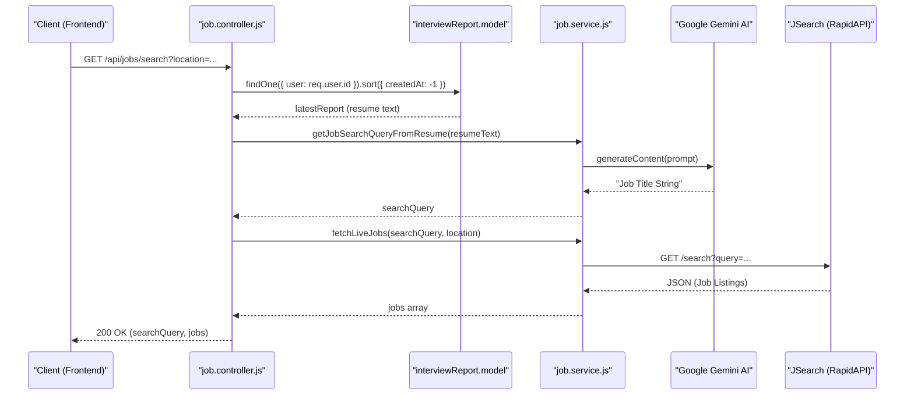

#### Component Breakdown

1. **Controller Logic** — Validates `location` query param, retrieves the most recent resume from MongoDB, coordinates AI query generation and external job fetching.
2. **AI Query Extraction** — `getJobSearchQueryFromResume` uses `gemini-1.5-flash` to translate a full resume into a concise job title search term. Falls back to "Software Engineer" on failure.
3. **External API Integration** — `fetchLiveJobs` calls JSearch API via RapidAPI with `X-RapidAPI-Key` and `X-RapidAPI-Host` headers.

---

### Database & Data Models

The persistence layer uses MongoDB with the Mongoose ODM. The `connectToDB` function connects using `process.env.MONGO_URI` during server initialization.

#### 1. User Model (`users` collection)

| Field | Type | Validation | Description |
| :--- | :--- | :--- | :--- |
| `username` | String | Unique, Required | Unique identifier for the user |
| `email` | String | Unique, Required | User's email address for login |
| `password` | String | Required | Bcrypt hashed password string |

#### 2. InterviewReport Model (`interviewreports` collection)

The most complex entity, storing AI analysis output with several sub-schemas:

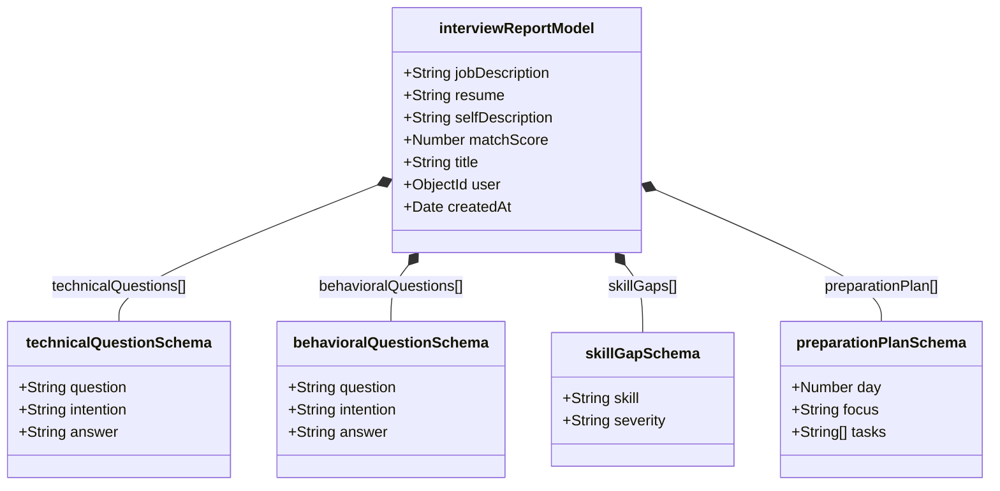

**Sub-Schema Details:**
- **technicalQuestionSchema** — AI-generated technical questions with `intention` and ideal `answer`.
- **behavioralQuestionSchema** — Soft-skill and situational questions.
- **skillGapSchema** — Missing competencies with `severity` enum: `low`, `medium`, `high`.
- **preparationPlanSchema** — Day-by-day roadmap with `focus` area and specific `tasks`.

**Key Fields:**
- `user` — Reference to the `users` collection via `ObjectId`.
- `matchScore` — Numeric value (0-100) representing candidate fit.
- `timestamps` — Auto-managed `createdAt` and `updatedAt`.

#### 3. BlacklistToken Model (`blacklistTokens` collection)

| Field | Type | Description |
| :--- | :--- | :--- |
| `token` | String | The JWT string to be invalidated |
| `createdAt` | Date | Auto-generated timestamp |

---

## Frontend

The frontend is a modern Single Page Application (SPA) built with **React 19** and **Vite**. It provides a glassmorphism-themed interface for uploading resumes, generating AI-driven interview preparation reports, and tracking job search progress.

### Application Entry Point

1. `Frontend/index.html` provides the `<div id="root">`.
2. `Frontend/src/main.jsx` uses `createRoot` to mount the React tree.
3. `style.scss` is imported at the entry point to initialize CSS variables and base layouts.
4. `App.jsx` wraps the entire application in global context providers.

### Global Provider Tree

| Provider | Purpose | Key Data/Methods |
| :--- | :--- | :--- |
| `AuthProvider` | Manages user session, login, and registration | `user`, `loading`, `handleLogin`, `handleLogout` |
| `InterviewProvider` | Manages report generation and history | `reports`, `generateReport`, `getReportById` |
| `RouterProvider` | Handles client-side routing logic | `router` configuration object |

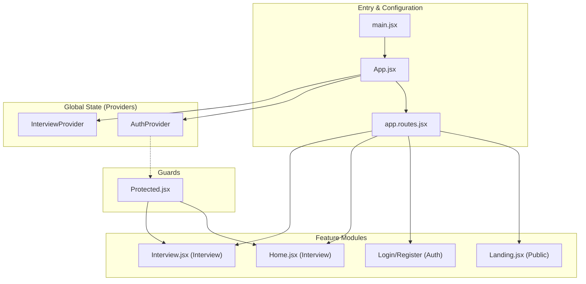

---

### Routing & Application Shell

Routes are defined in `Frontend/src/app.routes.jsx` using `createBrowserRouter`:

| Path | Component | Guard | Purpose |
| :--- | :--- | :--- | :--- |
| `/` | `Landing` | None | Public landing page |
| `/login` | `Login` | None | User authentication |
| `/register` | `Register` | None | New user account creation |
| `/dashboard` | `Home` | `Protected` | Dashboard for generating and viewing reports |
| `/interview/:interviewId` | `Interview` | `Protected` | Detailed AI-generated interview report |

#### Authentication Guard (`Protected` Component)

The `Protected` component implements a three-state logic gate:
1. **Loading** — Renders a loading placeholder during the initial `get-me` API call.
2. **Unauthenticated** — Redirects to `/login` via `<Navigate />`.
3. **Authenticated** — Renders the child components.

---

### Authentication Feature

#### State Management

The `AuthContext` is the single source of truth for authentication state, tracking `user` (Object or null) and `loading` (Boolean).

#### `useAuth` Hook

| Method | Description |
| :--- | :--- |
| `handleLogin({ email, password })` | Calls login service, updates context, returns `true` on success |
| `handleRegister({ username, email, password })` | Calls register service, returns `{ success, message }` |
| `handleLogout()` | Calls logout service, resets `user` to `null` |

**Session Restoration:** On mount, a `useEffect` calls the `getMe` endpoint to restore sessions via the HTTP-only JWT cookie.

#### API Service Layer (`auth.api.js`)

Uses Axios with `withCredentials: true` for cookie-based auth:

| Function | Endpoint | Method |
| :--- | :--- | :--- |
| `register` | `/api/auth/register` | POST |
| `login` | `/api/auth/login` | POST |
| `logout` | `/api/auth/logout` | GET |
| `getMe` | `/api/auth/get-me` | GET |

---

### Interview Feature

The core value proposition — AI-generated interview preparation reports, customized roadmaps, and job search.

#### `useInterview` Hook

| Function | Description |
| :--- | :--- |
| `generateReport` | Triggers the AI pipeline to create a new report |
| `getReportById` | Fetches a specific report and updates state |
| `getReports` | Retrieves all reports for the dashboard list |
| `getResumePdf` | Downloads a generated PDF version of the optimized resume |

#### UI Pages

**Home Dashboard (`Home.jsx`):**
- Two-panel layout: left panel for job description, right panel for resume upload (dropzone) and self-description.
- Displays a list of previously generated reports.

**Interview Detail Page (`Interview.jsx`):**
- Tabbed navigation system with:
  - **Technical Questions** — AI-generated queries with intention and model answers.
  - **Behavioral Questions** — Soft-skill and situational responses.
  - **Road Map** — Structured daily preparation plan.
  - **Find Jobs** — Integrated live job search using the user's resume context.

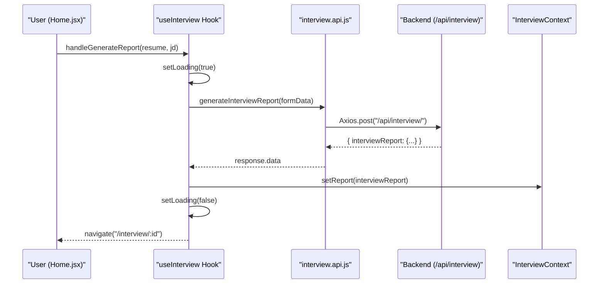

---

### Public Landing Page

The unauthenticated entry point (`Frontend/src/features/public/pages/Landing.jsx`) highlighting AI capabilities with clear CTAs.

**Sections:**
| Section | Purpose |
| :--- | :--- |
| **Hero** | Value proposition and conversion CTAs |
| **Social Proof** | Trust building via brand association |
| **Features Grid** | 4 feature cards (Job Matcher, Analysis, Strategy, Roadmaps) |
| **How It Works** | 3-step numbered user journey |
| **Footer** | Developer links (Portfolio, GitHub, LinkedIn) |

---

### Styling System

Built on a modern SCSS architecture emphasizing **glassmorphism** design.

#### Global CSS Variables (`Frontend/src/style.scss`)

| Variable | Value | Purpose |
| :--- | :--- | :--- |
| `--bg-dark` | `#09090b` | Base background color (Zinc 950) |
| `--glass-bg` | `rgba(255, 255, 255, 0.03)` | Semi-transparent panel background |
| `--glass-border` | `rgba(255, 255, 255, 0.08)` | Subtle border for glass elements |
| `--accent-color` | `#10b981` | Primary emerald green brand color |
| `--accent-gradient` | `linear-gradient(...)` | Gradient for buttons and text highlights |
| `--text-primary` | `#fafafa` | Main body text color |
| `--text-secondary` | `#a1a1aa` | Muted text for descriptions |

#### Key Classes
- `.glass-panel` — Applies `backdrop-filter: blur(16px)` and subtle border for depth.
- `.text-gradient` — Used for brand logo and hero highlights.
- `.primary-button` — Uses `--accent-gradient` background with custom box-shadow.

#### Feature-Specific Stylesheets
- `landing.scss` — Public landing page with animations (`.pulse-dot`) and responsive `.features-grid`.
- `home.scss` — Dashboard styling with local theme variables.
- `interview.scss` — 3-column layout (220px sidebar, flexible content, scrollable report area).
- `auth.form.scss` — Glassmorphism forms with `backdrop-filter: blur(16px)`.

---

## API Reference

Base URL: `/api`. All protected routes require a valid JWT provided via an HTTP-only cookie.

### Auth Endpoints (`/api/auth`)

#### `POST /api/auth/register`
Creates a new user account and issues a JWT cookie.

**Access:** Public

**Request Body:**
```json
{
  "username": "johndoe",
  "email": "john@example.com",
  "password": "securepassword123"
}
```

**Response:** `201 Created` with `Set-Cookie: token=...`

---

#### `POST /api/auth/login`
Authenticates a user and issues a JWT cookie.

**Access:** Public

**Request Body:**
```json
{
  "email": "john@example.com",
  "password": "securepassword123"
}
```

**Response:** `200 OK` with `Set-Cookie: token=...`

---

#### `GET /api/auth/logout`
Terminates the session by blacklisting the token and clearing the cookie.

**Access:** Public (reads token from cookies)

---

#### `GET /api/auth/get-me`
Returns the currently authenticated user's profile.

**Access:** Private (requires valid JWT)

**Response:**
```json
{
  "message": "User details fetched successfully",
  "user": {
    "id": "6789abcdef...",
    "username": "johndoe",
    "email": "john@example.com"
  }
}
```

---

### Interview Endpoints (`/api/interview`)

All endpoints require authentication via `authMiddleware.authUser`.

#### `POST /api/interview/`
Generates a full AI-driven preparation report.

**Content-Type:** `multipart/form-data`

| Field | Type | Description |
| :--- | :--- | :--- |
| `resume` | File (PDF) | The user's current resume |
| `jobDescription` | String | Target job posting text |
| `selfDescription` | String | User's additional context or career goals. |

**Success Response:** `201 Created`
```json
{
  "message": "Interview report generated successfully.",
  "interviewReport": {
    "_id": "...",
    "user": "...",
    "resume": "...",
    "selfDescription": "...",
    "jobDescription": "...",
    "matchScore": 85,
    "title": "Software Engineer at Google",
    "technicalQuestions": [...],
    "behavioralQuestions": [...],
    "skillGaps": [...],
    "preparationPlan": [...],
    "createdAt": "...",
    "updatedAt": "..."
  }
}
```

**Implementation Details:**
The controller uses `pdf-parse` to extract text from the uploaded file buffer. This text, along with the strings from `req.body`, is passed to the AI service. The AI response is merged with the input data and user ID to create a new `InterviewReport` document in MongoDB.

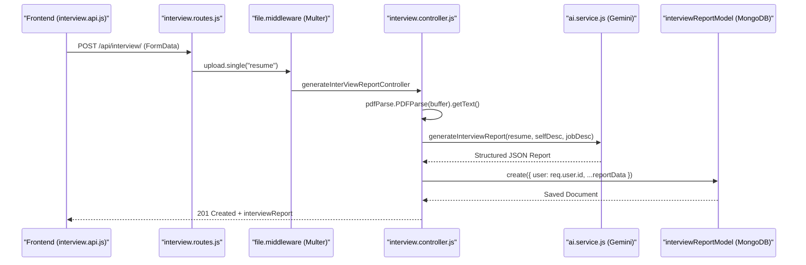

---

#### `GET /api/interview/`
Retrieves a summary list of all reports generated by the logged-in user.

**Access:** Private (requires valid JWT)

**Response:** `200 OK`

The response is optimized for a dashboard view by excluding heavy fields like full question lists, preparation plans, resume text, self-description, and job description.

```json
{
  "message": "Interview reports fetched successfully.",
  "interviewReports": [
    {
      "_id": "...",
      "title": "Software Engineer at Google",
      "matchScore": 85,
      "user": "...",
      "createdAt": "..."
    }
  ]
}
```

---

#### `GET /api/interview/report/:interviewId`
Fetches the complete details of a specific interview report.

**Access:** Private (requires valid JWT)

**URL Parameters:**
| Parameter | Type | Description |
| :--- | :--- | :--- |
| `interviewId` | String | The MongoDB `_id` of the interview report. |

**Response:** `200 OK`
```json
{
  "message": "Interview report fetched successfully.",
  "interviewReport": {
    "_id": "...",
    "user": "...",
    "resume": "...",
    "selfDescription": "...",
    "jobDescription": "...",
    "matchScore": 85,
    "title": "Software Engineer at Google",
    "technicalQuestions": [
      { "question": "...", "intention": "...", "answer": "..." }
    ],
    "behavioralQuestions": [
      { "question": "...", "intention": "...", "answer": "..." }
    ],
    "skillGaps": [
      { "skill": "...", "severity": "low|medium|high" }
    ],
    "preparationPlan": [
      { "day": 1, "focus": "...", "tasks": ["..."] }
    ],
    "createdAt": "...",
    "updatedAt": "..."
  }
}
```

**Error Response:** `404 Not Found` — If the report does not exist or does not belong to the authenticated user.

**Security Note:** The controller verifies that the requested `interviewId` belongs to `req.user.id` to prevent unauthorized access to other users' data.

---

#### `POST /api/interview/resume/pdf/:interviewReportId`
Triggers the AI to rewrite the user's resume based on the job description and generates a downloadable, ATS-friendly PDF.

**Access:** Private (requires valid JWT)

**URL Parameters:**
| Parameter | Type | Description |
| :--- | :--- | :--- |
| `interviewReportId` | String | The MongoDB `_id` of the interview report to base the resume on. |

**Response Type:** `application/pdf` (Binary Blob)

**Response Headers:**
```
Content-Type: application/pdf
Content-Disposition: attachment; filename=resume_{interviewReportId}.pdf
```

**Process Flow:**
1. Retrieves the original `resume`, `jobDescription`, and `selfDescription` from the stored `interviewReport` document.
2. Calls `generateResumePdf` which uses Google Gemini to generate professional, ATS-friendly HTML.
3. Uses **Puppeteer** (headless Chrome) to render the HTML into a PDF buffer (A4 format, custom margins).
4. Sets response headers for file attachment download and sends the binary PDF buffer.

**Error Response:** `404 Not Found` — If the interview report does not exist.

---

### Interview Endpoints — Entity Mapping

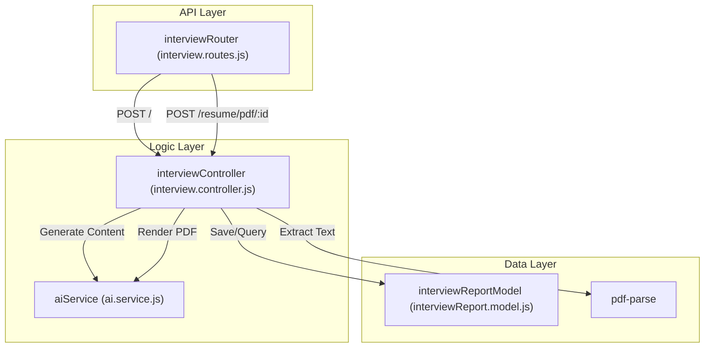

#### Key Functions Reference

| Function Name | Location | Responsibility |
| :--- | :--- | :--- |
| `generateInterViewReportController` | `interview.controller.js` | Orchestrates PDF parsing, AI calling, and DB saving. |
| `getInterviewReportByIdController` | `interview.controller.js` | Fetches a single report with ownership verification. |
| `getAllInterviewReportsController` | `interview.controller.js` | Returns optimized summary list for dashboard. |
| `generateResumePdfController` | `interview.controller.js` | Handles PDF generation requests and streams the response. |

---

### Job Search Endpoint (`/api/jobs`)

The `/api/jobs` endpoint provides a specialized interface for retrieving live job listings based on a user's professional profile. It implements a two-stage pipeline that first uses Google Gemini AI to extract an optimized search query from the user's most recent resume and then queries the JSearch RapidAPI to fetch real-time job openings.

#### `GET /api/jobs/search`
Retrieves a list of active job postings relevant to the user's background.

**Access:** Private (requires valid JWT)

**Query Parameters:**
| Parameter | Type | Required | Description |
| :--- | :--- | :--- | :--- |
| `location` | String | Yes | The geographic area to search for jobs (e.g., "New York", "Remote"). |

**Response:** `200 OK`
```json
{
  "message": "Jobs fetched successfully",
  "searchQuery": "Senior React Developer",
  "jobs": [
    {
      "job_id": "...",
      "employer_name": "...",
      "job_title": "...",
      "job_apply_link": "...",
      "job_description": "...",
      "job_city": "...",
      "job_state": "..."
    }
  ]
}
```

**Process Flow:**

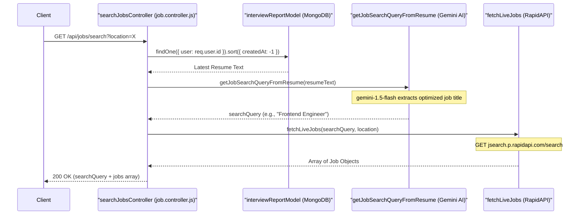

**Component Breakdown:**
1. **Resume Extraction** — The controller queries `interviewReportModel` to find the most recent report by the authenticated user. The `resume` field (plain text) serves as context for the AI query.
2. **AI Query Generation** — `getJobSearchQueryFromResume` uses `gemini-1.5-flash` to analyze the resume and return a highly accurate job title string. Falls back to "Software Engineer" on failure.
3. **External Job Fetching** — `fetchLiveJobs` calls the JSearch API via RapidAPI. The query is formatted as `${searchQuery} in ${location}`.

**Error Handling:**

| Status Code | Scenario |
| :--- | :--- |
| `400 Bad Request` | Missing `location` query parameter |
| `401 Unauthorized` | Invalid or missing JWT cookie |
| `404 Not Found` | User has no previous interview reports |
| `500 Server Error` | External API failure or DB connection issue |

---

## Glossary

| Term | Definition |
| :--- | :--- |
| **Interview Report** | The primary data entity containing AI-generated analysis, questions, and preparation plans. Stored in the `interviewreports` MongoDB collection. |
| **Skill Gap** | A discrepancy identified by AI between a user's resume and the requirements of a job description. Includes a `severity` level (low/medium/high). |
| **Match Score** | A numerical value (0-100) representing the compatibility between a candidate and a job description. |
| **Preparation Plan** | A day-wise roadmap generated by Gemini to help users study for a specific role. Contains `day`, `focus`, and `tasks` fields. |
| **Glassmorphism** | The UI design language used throughout the frontend, characterized by translucent backgrounds (`backdrop-filter: blur`) and subtle borders. |
| **JWT (JSON Web Token)** | Used for stateless authentication. The token is stored in a browser HTTP-only cookie and verified on each protected request. |
| **Token Blacklisting** | A security measure where logged-out tokens are stored in MongoDB (`blacklistTokens` collection) to prevent reuse before they expire. |
| **Auth Middleware (`authUser`)** | A function that intercepts requests to protected routes, checks for a cookie, verifies it against the blacklist, and validates the JWT signature. |
| **Zod Schema** | A TypeScript-first schema declaration and validation library used to force the AI to return valid JSON that matches the backend models. |
| **zod-to-json-schema** | A utility that converts Zod definitions into JSON schemas, which are then passed to the Google Generative AI `responseSchema` configuration. |
| **Puppeteer** | A headless browser used on the backend to render AI-generated HTML into a professional PDF resume (A4 format). |
| **Multer** | Express middleware for handling `multipart/form-data`, specifically for uploading resume PDF files. Uses `memoryStorage()` with a 3MB limit. |
| **JSearch API** | A RapidAPI service used to fetch real-time job listings based on AI-generated search queries. |
| **Gemini (Google GenAI)** | The Large Language Model used for text analysis and generation. The system uses `gemini-1.5-flash` and `gemini-3-flash-preview` models. |

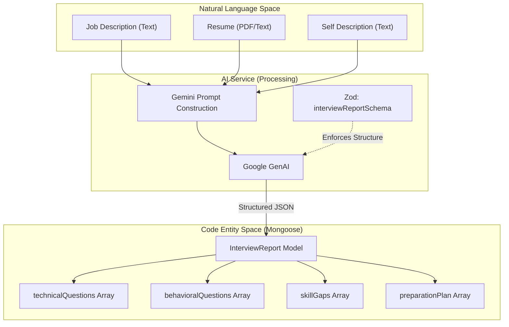

### Mongoose Sub-Schemas Reference

| Schema Name | Key Fields | Purpose |
| :--- | :--- | :--- |
| `technicalQuestionSchema` | `question`, `intention`, `answer` | Maps technical concepts to interviewer expectations. |
| `behavioralQuestionSchema` | `question`, `intention`, `answer` | Focuses on soft skills and situational responses. |
| `skillGapSchema` | `skill`, `severity` (low/medium/high) | Identifies weaknesses in the candidate's profile. |
| `preparationPlanSchema` | `day`, `focus`, `tasks` | Provides a structured study timeline. |
