<p align="center">
  
  
  
  
  
  
  
  
</p>
 
# HirePrep AI
 
**An AI-powered career platform that transforms resumes into actionable strategy with live interactive mock interviews, real-time audio coaching, and dynamic study roadmaps using Google Gemini.**
 
HirePrep AI is a full-stack interview preparation platform designed to help candidates bridge the gap between their current profile and their target job roles. By leveraging Large Language Models (LLMs) and real-time voice synthesis, the platform provides personalized roadmaps, deep resume analysis, and interactive mock interview sessions.
 
---
 
## Table of Contents
 
- [Core Features](#core-features)
- [Tech Stack](#tech-stack)
- [Monorepo Structure](#monorepo-structure)
- [Architecture Overview](#architecture-overview)
- [Getting Started & Local Development](#getting-started--local-development)
  - [Prerequisites](#prerequisites)
  - [Repository Setup](#repository-setup)
  - [Environment Configuration](#environment-configuration)
  - [Running Locally](#running-locally)
- [Deployment](#deployment)
  - [Frontend Deployment (Vercel)](#frontend-deployment-vercel)
  - [Backend Deployment (Docker)](#backend-deployment-docker)
- [Backend Architecture](#backend-architecture)
  - [Server Bootstrap & Configuration](#server-bootstrap--configuration)
  - [Middleware Layer](#middleware-layer)
  - [Authentication System](#authentication-system)
  - [Interview API Routes & Controllers](#interview-api-routes--controllers)
  - [Job Search API](#job-search-api)
- [AI Service Layer](#ai-service-layer)
  - [Interview Report Generation](#interview-report-generation)
  - [AI-Generated Resume PDF](#ai-generated-resume-pdf)
  - [Live Interview AI Engine](#live-interview-ai-engine)
  - [Dynamic Roadmap Generation](#dynamic-roadmap-generation)
- [Frontend Architecture](#frontend-architecture)
  - [Routing & Protected Routes](#routing--protected-routes)
  - [Authentication Feature](#authentication-feature)
  - [Interview Feature — Dashboard & Report View](#interview-feature--dashboard--report-view)
  - [Live Interview Feature](#live-interview-feature)
  - [Public Landing Page](#public-landing-page)
  - [Frontend API Service Layer](#frontend-api-service-layer)
- [Data Models](#data-models)
  - [User Model](#user-model)
  - [InterviewReport Model](#interviewreport-model)
- [Security & Rate Limiting](#security--rate-limiting)
- [Troubleshooting](#troubleshooting)
- [Glossary](#glossary)
 
---
 
## Core Features
 
- **Deep Resume Analysis** — Maps career history to job requirements to identify strong suits and skill gaps.
- **AI Job Matcher** — Cross-references user profiles with live job boards via external APIs (JSearch / RapidAPI).
- **Live Voice Interviews** — Real-time, voice-enabled mock interviews with instant conversational feedback using the Web Speech API.
- **Instant Roadmaps** — Generates day-by-day preparation plans using Google Gemini, customizable to any duration.
- **ATS-Optimized Resumes** — Generates tailored PDF resumes rewritten specifically for target roles via Puppeteer rendering.
- **Real-time Coaching** — Per-answer feedback during live interview sessions with an AI "interview coach."
 
---
 
## Tech Stack
 
| Layer | Technology | Key Code Entities |
| :--- | :--- | :--- |
| **Frontend** | React 18, Vite, SCSS | `AuthProvider`, `InterviewProvider`, `useSpeech` |
| **Backend** | Node.js, Express | `server.js`, `interview.controller.js` |
| **Database** | MongoDB (Mongoose ODM) | `User`, `InterviewReport` |
| **Caching** | Redis | `redis.js`, `rateLimiter` |
| **AI / ML** | Google Gemini (`gemini-2.5-flash`) | `ai.service.js` |
| **PDF Generation** | Puppeteer | `globalBrowser`, `pdf-parse` |
| **File Uploads** | Multer (in-memory) | `file.middleware.js` |
| **Containerization** | Docker, Docker Compose | `Dockerfile`, `docker-compose.yml` |
| **Frontend Hosting** | Vercel | `vercel.json` |
 
---
 
## Monorepo Structure
 
The project is organized into a decoupled Frontend and Backend architecture, allowing for independent scaling and deployment.
 
```
HirePrep-AI/
├── Backend/
│   ├── server.js                    # Entry point — bootstrap sequence
│   ├── Dockerfile                   # Production container with Chromium
│   ├── docker-compose.yml           # Backend + Redis sidecar
│   ├── package.json
│   └── src/
│       ├── app.js                   # Express app, middleware pipeline
│       ├── config/
│       │   ├── database.js          # MongoDB connection (Mongoose)
│       │   └── redis.js             # Redis client with reconnect strategy
│       ├── controllers/
│       │   ├── auth.controller.js   # Register, login, logout, session
│       │   ├── interview.controller.js  # Report generation, live Q&A, roadmap
│       │   └── job.controller.js    # Job search orchestration
│       ├── middlewares/
│       │   ├── auth.middleware.js    # JWT verification + Redis blacklist
│       │   └── file.middleware.js   # Multer PDF upload (5 MB limit)
│       ├── models/
│       │   ├── user.model.js        # User schema (username, email, password)
│       │   └── interviewReport.model.js  # Report with nested sub-schemas
│       ├── routes/
│       │   ├── auth.routes.js       # /api/auth — rate-limited
│       │   ├── interview.routes.js  # /api/interview — AI rate-limited
│       │   └── job.routes.js        # /api/jobs — authenticated
│       └── services/
│           ├── ai.service.js        # Gemini integration, Zod schemas, caching
│           └── job.service.js       # JSearch RapidAPI integration
├── Frontend/
│   ├── index.html
│   ├── vercel.json                  # Vercel deployment config
│   ├── vite.config.js
│   ├── package.json
│   └── src/
│       ├── main.jsx                 # React entry point
│       ├── App.jsx                  # Provider tree (Auth → Interview → Router)
│       ├── app.routes.jsx           # Route definitions + ProtectedRoute
│       ├── style.scss               # Global glassmorphism design system
│       └── features/
│           ├── auth/
│           │   ├── auth.context.jsx     # Authentication state management
│           │   ├── pages/               # Login.jsx, Register.jsx
│           │   └── services/auth.api.js # Auth API client (Axios)
│           ├── interview/
│           │   ├── interview.context.jsx    # Interview state management
│           │   ├── hooks/
│           │   │   ├── useInterview.js      # Report generation & retrieval
│           │   │   └── useSpeech.js         # Web Speech API (TTS + STT)
│           │   ├── pages/
│           │   │   ├── Home.jsx             # Dashboard — upload resume + JD
│           │   │   ├── Interview.jsx        # Report detail — tabs view
│           │   │   └── LiveInterview.jsx    # Voice-enabled mock interview
│           │   ├── components/              # QuestionCard, RoadMapDay, etc.
│           │   ├── services/interview.api.js # Interview API client (Axios)
│           │   └── style/                   # SCSS modules
│           └── public/
│               ├── pages/Landing.jsx   # Public landing page
│               └── style/landing.scss  # Landing page styles
└── README.md
```
 
---
 
## Architecture Overview
 
### High-Level Component Interaction
 
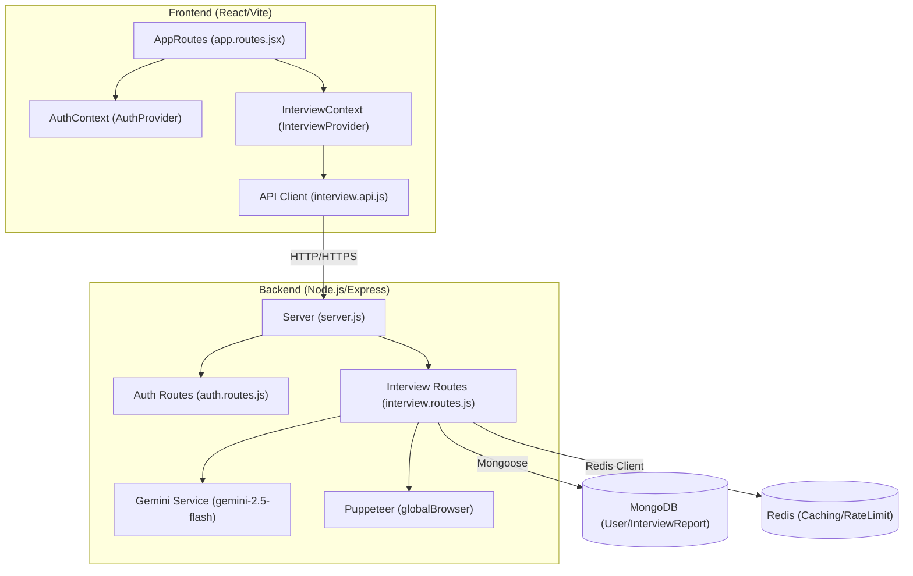
 
### Main User Journey
 
The user journey is designed as a four-step funnel from initial upload to live practice:
 
1. **Upload & Target** — The user provides a resume (PDF) and a target Job Description.
2. **Action Plan** — The system generates a match score, skill gap analysis, and a tailored Q&A roadmap.
3. **Resume Export** — Users can download an AI-optimized resume PDF generated via Puppeteer.
4. **Live Practice** — Engagement in a voice-enabled interview session with real-time feedback.
 
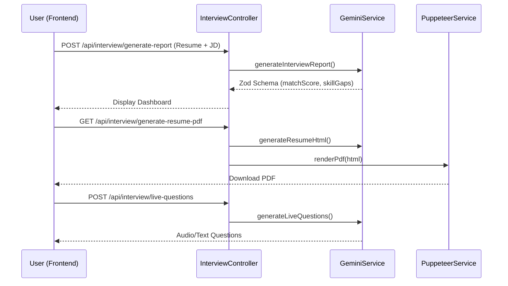
 
---
 
## Getting Started & Local Development
 
### Prerequisites
 
Before starting, ensure you have the following installed:
 
- **Node.js** — Version 20.0.0 or higher
- **MongoDB** — A local instance or a MongoDB Atlas connection string
- **Redis** — Required for rate limiting and AI response caching
- **Google Gemini API Key** — For AI generation features
- **RapidAPI Key** — For the JSearch job search integration
 
### Repository Setup
 
Clone the repository and install dependencies for both the server and the client:
 
```bash
git clone https://github.com/harshitzofficial/-HirePrep-AI.git
cd -HirePrep-AI
```
 
#### Backend Installation
 
```bash
cd Backend
npm install
```
 
The backend relies on critical dependencies including `express`, `mongoose` for data modeling, `redis` for caching, and `puppeteer` for PDF generation.
 
#### Frontend Installation
 
```bash
cd Frontend
npm install
```
 
The frontend is built with `react` and `vite`, using `sass` for styling and `axios` for API communication.
 
### Environment Configuration
 
You must create `.env` files in both the `Backend/` and `Frontend/` directories.
 
#### Backend `.env`
 
Create `Backend/.env` with the following variables:
 
| Variable | Description |
| :--- | :--- |
| `MONGO_URI` | MongoDB connection string for storing users and interview reports. |
| `REDIS_URL` | Redis connection URL (e.g., `redis://localhost:6379`). |
| `GOOGLE_GENAI_API_KEY` | API key for Google Gemini (`gemini-2.5-flash`). |
| `RAPIDAPI_KEY` | Key for JSearch API via RapidAPI. |
| `JWT_SECRET` | Secret string used for signing authentication tokens. |
| `FRONTEND_URL` | The URL of the running frontend (e.g., `http://localhost:5173`). |
| `PORT` | Port for the backend server (defaults to `5000`). |
 
#### Frontend `.env`
 
Create `Frontend/.env` with the following variable:
 
| Variable | Description |
| :--- | :--- |
| `VITE_API_URL` | The base URL of the backend API (e.g., `http://localhost:5000/api`). |
 
### Running Locally
 
#### Starting the Backend
 
The backend uses `nodemon` for hot-reloading during development:
 
```bash
cd Backend
npm run dev
```
 
The server will initialize connections to MongoDB and Redis before listening for requests.
 
#### Starting the Frontend
 
The frontend uses the Vite development server:
 
```bash
cd Frontend
npm run dev
```
 
The application will typically be available at `http://localhost:5173`.
 
### Local Development Architecture
 
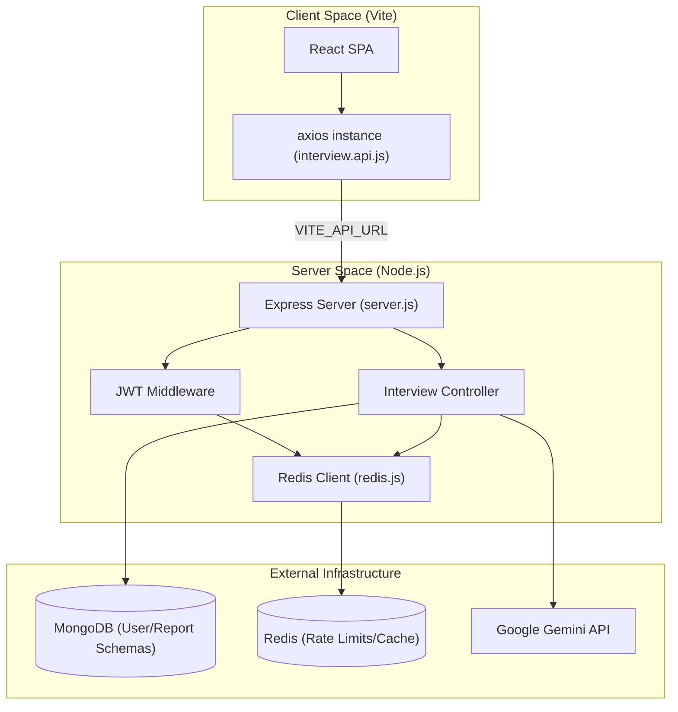
 
### Request Lifecycle: Resume Analysis
 
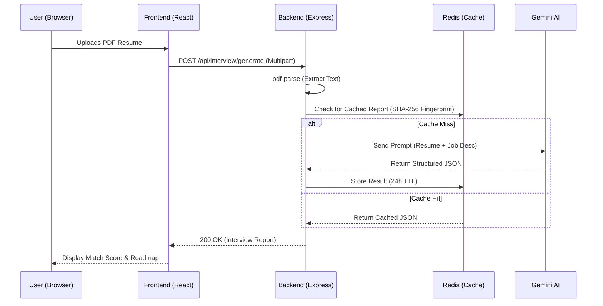
 
---
 
## Deployment
 
The application follows a decoupled deployment strategy: the React frontend is hosted on **Vercel** as a static site, while the Node.js backend is containerized using **Docker** to manage complex system dependencies (like Chromium for PDF generation) and a Redis sidecar for state management.
 
### Frontend Deployment (Vercel)
 
The frontend is deployed to Vercel, utilizing its native support for Single Page Applications (SPAs).
 
**Build Configuration** (via `vercel.json`):
- **Build Command**: `npm run build`
- **Output Directory**: `dist`
 
The frontend relies on the `VITE_API_URL` environment variable to locate the backend. In production, this must point to the deployed Docker container's URL (e.g., `https://api.hireprep.ai`).
 
### Backend Deployment (Docker)
 
The backend is containerized to ensure environment parity and to handle the installation of native Linux libraries required by Puppeteer for PDF generation.
 
#### Dockerfile Implementation
 
The `Dockerfile` uses `node:22-alpine` as the base image with key implementation details:
 
1. **Chromium Installation** — Installs Alpine's native Chromium and font rendering libraries (`nss`, `freetype`, `harfbuzz`) for PDF generation.
2. **Puppeteer Configuration** — Environment variables `PUPPETEER_SKIP_DOWNLOAD=true` and `PUPPETEER_EXECUTABLE_PATH=/usr/bin/chromium-browser` instruct Puppeteer to use the system-installed Chromium.
3. **Security** — The application runs under the low-privileged `node` user.
4. **Production Optimization** — `npm ci --omit=dev` installs only necessary runtime dependencies.
 
#### Docker Compose & Sidecar Services
 
| Service | Image | Purpose |
| :--- | :--- | :--- |
| `backend` | Custom (via `Dockerfile`) | Express API server |
| `redis` | `redis:alpine` | Caching, rate-limiting, and session management |
 
The `backend` service depends on `redis` and connects via the internal Docker network using `redis://redis:6379`.
 
```bash
# Build and start the services
docker-compose up --build
```
 
#### Deployment Infrastructure
 
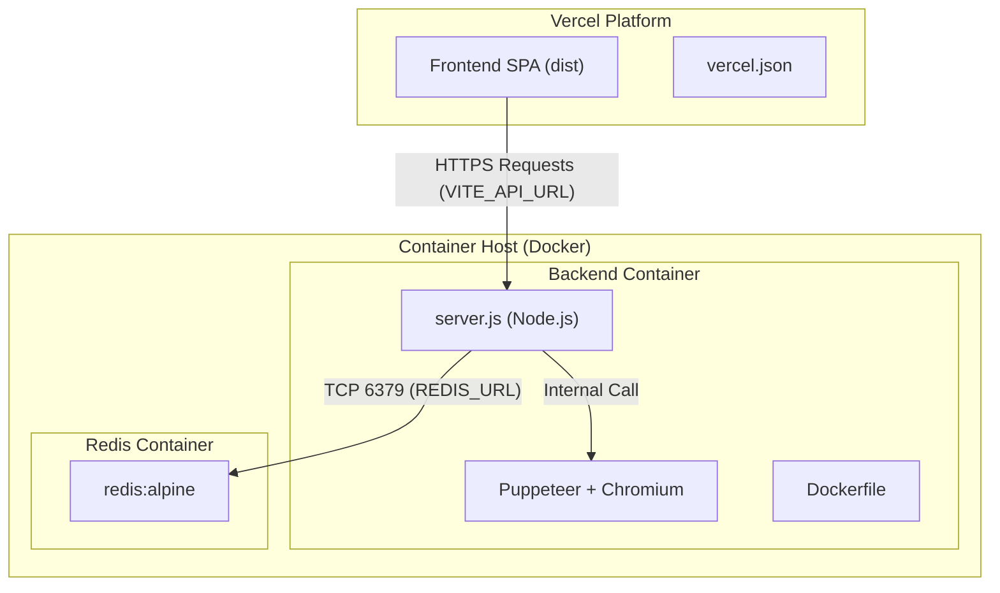
 
#### Environment Differences
 
| Variable | Local Development | Production (Docker/Vercel) |
| :--- | :--- | :--- |
| `REDIS_URL` | `redis://localhost:6379` | `redis://redis:6379` (Docker internal) |
| `NODE_ENV` | `development` | `production` |
| `PUPPETEER_EXECUTABLE_PATH` | Not required (uses local) | `/usr/bin/chromium-browser` |
| `VITE_API_URL` | `http://localhost:3000` | Deployed Backend URL |
 
---
 
## Backend Architecture
 
The HirePrep AI backend is a Node.js and Express application that orchestrates AI-driven interview preparation, job searching, and secure user management. It serves as the bridge between the React frontend, the MongoDB persistence layer, Redis for caching/rate-limiting, and the Google Gemini AI services.
 
### Server Bootstrap & Configuration
 
The backend follows a strict sequential bootstrap process to ensure all critical infrastructure (MongoDB and Redis) is fully operational before accepting traffic.
 
#### Bootstrap Sequence
 
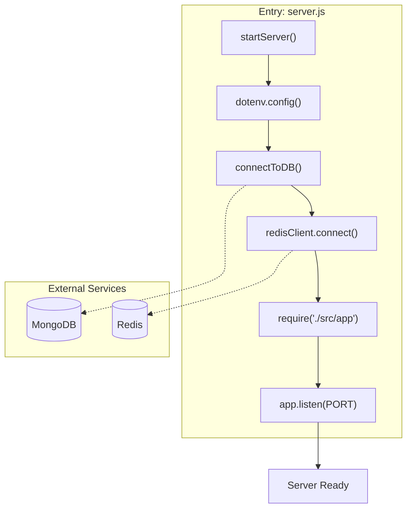
 
1. **Environment Loading** — Loads variables from `.env` via `dotenv`.
2. **Database Initialization** — Calls `connectToDB()` to establish a Mongoose connection to MongoDB.
3. **Cache Initialization** — Calls `redisClient.connect()` to establish a persistent connection to Redis.
4. **Application Loading** — The Express `app` is required **only after** successful database connections.
5. **Port Binding** — The server begins listening on the configured `PORT` (defaults to `3000`).
 
#### Database Configuration (MongoDB)
 
| Feature | Implementation |
| :--- | :--- |
| **Library** | `mongoose` |
| **Connection String** | `process.env.MONGO_URI` |
| **Error Handling** | Logs error and executes `process.exit(1)` on failure |
 
#### Cache Configuration (Redis)
 
- **URL Resolution** — Defaults to `redis://localhost:6379` for local development but uses `process.env.REDIS_URL` (typically `redis://redis:6379` in Docker).
- **Keep-Alive** — A `pingInterval` of 300,000ms (5 minutes) prevents socket timeouts.
- **Reconnect Strategy** — Implements exponential backoff: `Math.min(retries * 100, 3000)`, capping at 3 seconds, with a maximum of 10 retry attempts.
 
### Middleware Layer
 
The Middleware Layer serves as the processing pipeline for all incoming HTTP requests, handling cross-cutting concerns including security headers, session management, authentication verification, and file upload validation.
 
#### Global Middleware Pipeline
 
| Middleware | Purpose | Implementation Detail |
| :--- | :--- | :--- |
| **Trust Proxy** | IP Resolution | `app.set("trust proxy", 1)` for correct client IP detection behind load balancers |
| **CORS** | Security | Dynamic origin matching with trailing slash sanitization via `FRONTEND_URL` |
| **Body Parser** | Data Handling | `express.json()` for parsing incoming JSON payloads |
| **Cookie Parser** | Auth Support | Parses cookies for JWT-based session management |
| **Auth Guard** | Security | Custom `protect` middleware verifying JWTs and Redis blacklists |
 
#### CORS Configuration
 
| Setting | Value | Purpose |
| :--- | :--- | :--- |
| `origin` | `process.env.FRONTEND_URL` | Restricts access to the specific frontend domain |
| `credentials` | `true` | Allows the browser to send cookies (JWT) with cross-origin requests |
 
#### Authentication Middleware (`authUser`)
 
The `authUser` middleware is the primary security gate for protected routes. It implements a multi-step verification process:
 
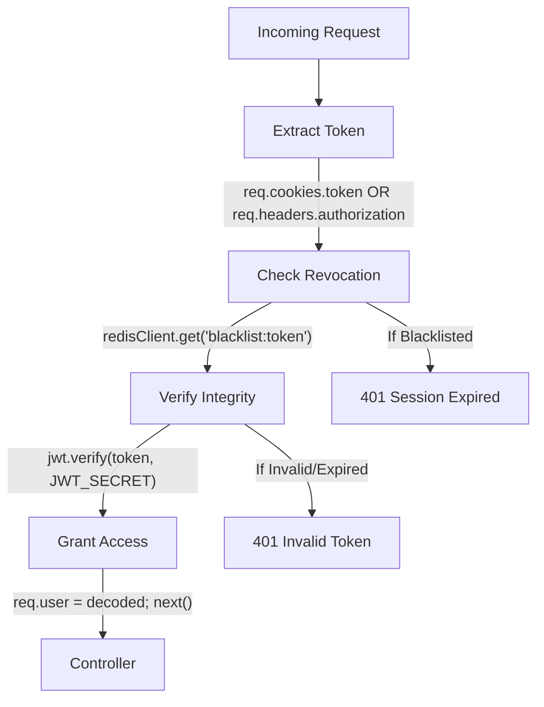
 
1. **Token Extraction** — Looks for a token in the `token` cookie or the `Authorization` Bearer header.
2. **Blacklist Check** — Queries Redis using `blacklist:${token}`. If found, access is denied even if the JWT signature is valid.
3. **JWT Verification** — Uses `jwt.verify` with `JWT_SECRET` to ensure the token hasn't been tampered with.
4. **Context Attachment** — Upon success, the decoded payload is attached to `req.user`.
 
#### File Upload Middleware (`multer`)
 
- **Storage Strategy** — Uses `memoryStorage()`. Files are held in RAM as a Buffer.
- **Size Limit** — Hard limit of **5 MB** to prevent Large File attacks.
- **MIME Type Filter** — Only `application/pdf` files are accepted.
 
### Authentication System
 
The Authentication System provides a secure, session-based experience using JWT stored in cross-domain cookies. It features password hashing with `bcrypt`, Redis-backed token blacklisting for secure logouts, and rate-limiting.
 
#### API Endpoints
 
| Method | Endpoint | Description |
| :--- | :--- | :--- |
| POST | `/api/auth/register` | Register a new user account |
| POST | `/api/auth/login` | Authenticate and receive JWT |
| POST | `/api/auth/logout` | Invalidate session (blacklist token) |
| GET | `/api/auth/get-me` | Get current authenticated user profile |
 
#### Password Security
 
Passwords are never stored in plain text. The system uses `bcryptjs` to hash passwords with **10 salt rounds** before saving to MongoDB. During login, `bcrypt.compare` verifies the provided password against the stored hash.
 
#### JWT Issuance and Cookie Configuration
 
| Property | Value | Purpose |
| :--- | :--- | :--- |
| `httpOnly` | `true` | Prevents client-side scripts from accessing the token (mitigates XSS) |
| `secure` | `true` | Ensures the cookie is only sent over HTTPS |
| `sameSite` | `"None"` | Allows cross-domain cookie transmission (Vercel frontend ↔ Docker backend) |
| `maxAge` | `1 day` | Defines the session duration |
 
#### Secure Logout & Redis Blacklisting
 
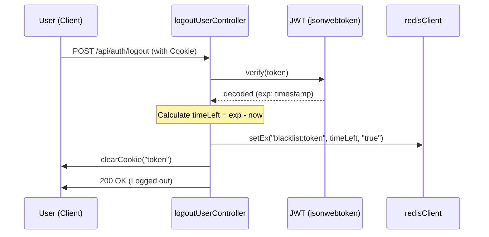
 
#### Auth Rate Limiting
 
- **Configuration**: Limits each IP to **10 requests per 15-minute window**.
- **Storage**: State is maintained in Redis to persist across server restarts.
 
### Interview API Routes & Controllers
 
The Interview API serves as the primary interface for all AI-driven features. It handles resume parsing, interview report generation, live Q&A evaluation, and dynamic roadmap creation.
 
#### AI Rate Limiter
 
- **Configuration**: Limits each IP to **10 requests per 15 minutes**.
- **Storage**: Uses `RedisStore` for distributed state management.
 
#### Route Definitions
 
| Method | Endpoint | Description | Middleware |
| :--- | :--- | :--- | :--- |
| POST | `/api/interview/` | Generate new interview report | `authUser`, `aiRateLimiter`, `handleResumeUpload` |
| GET | `/api/interview/` | Get all reports for logged-in user | `authUser` |
| GET | `/api/interview/report/:interviewId` | Get specific report details | `authUser` |
| POST | `/api/interview/resume/pdf/:interviewReportId` | Generate ATS-optimized PDF | `authUser`, `aiRateLimiter` |
| POST | `/api/interview/live/questions` | Generate 3 live interview questions | `authUser`, `aiRateLimiter` |
| POST | `/api/interview/live/evaluate` | Full interview transcript evaluation | `authUser`, `aiRateLimiter` |
| POST | `/api/interview/live/evaluate-single` | Real-time coaching for one answer | `authUser`, `aiRateLimiter` |
| POST | `/api/interview/roadmap/dynamic` | Generate custom-day roadmap | `authUser`, `aiRateLimiter` |
 
#### Interview Report Generation Flow
 
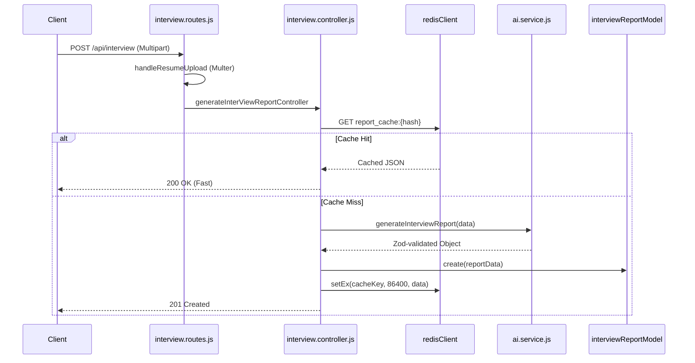
 
1. **PDF Parsing** — Extracts raw text from the uploaded PDF buffer via `pdf-parse`.
2. **Fingerprinting** — Creates a SHA-256 hash using `userId`, `resumeText`, `jobDescription`, and `selfDescription`.
3. **Cache Lookup** — Checks Redis for `report_cache:<hash>`. If found, returns immediately.
4. **AI Invocation** — On cache miss, calls `generateInterviewReport` from the AI service.
5. **Persistence** — Saves to MongoDB and caches in Redis with a **24-hour TTL**.
 
#### Controller Actions
 
- **`getAllInterviewReportsController`** — Fetches all reports with heavy fields excluded (resume, jobDescription, questions) for optimized payload size.
- **`getInterviewReportByIdController`** — Fetches complete report. Enforces security by matching `user` ID with authenticated `req.user.id`.
- **`getLiveQuestionsController`** — Calls AI service to produce three questions based on interview type (Technical, Behavioral, or Mixed).
- **`evaluateSingleAnswerController`** — Provides instant per-answer coaching during live sessions.
- **`evaluateInterviewController`** — Analyzes full transcript for `overallScore` and skills breakdown.
- **`generateResumePdfController`** — Generates ATS-optimized HTML via AI, renders to PDF via Puppeteer.
- **`generateDynamicRoadmapController`** — Regenerates preparation plan for a custom number of days.
 
### Job Search API
 
The Job Search API provides a bridge between a user's professional profile and real-world employment opportunities, leveraging Google Gemini for semantic analysis and JSearch RapidAPI for real-time listings.
 
#### Pipeline
 
1. **Authentication & Rate Limiting** — Ensures the user is logged in and hasn't exceeded the search quota.
2. **Resume Retrieval** — Fetches the user's most recent resume text from the database.
3. **AI-Powered Keyword Extraction** — Sends the resume to Gemini to extract the most relevant job search keywords.
4. **External Job Search** — Queries JSearch RapidAPI with extracted keywords and user-specified location.
5. **Response Delivery** — Returns structured job listings to the frontend.
 
---
 
## AI Service Layer
 
The AI Service Layer is responsible for integrating Google Gemini capabilities into the application. It uses `gemini-2.5-flash` with strict Zod schema validation to ensure predictable, structured responses.
 
### Interview Report Generation
 
The `generateInterviewReport()` function orchestrates the core analysis pipeline:
 
- **Input**: Resume text, job description, and self-description.
- **Processing**: Sends a structured prompt to Gemini, requesting match scoring, skill gap identification, Q&A generation, and roadmap planning.
- **Output Validation**: Uses a comprehensive Zod schema (`interviewReportSchema`) to validate the AI response includes `matchScore`, `detectedSkills`, `technicalQuestions`, `behavioralQuestions`, `skillGaps`, and `preparationPlan`.
- **Caching**: Results are cached in Redis with a SHA-256 fingerprint key and 24-hour TTL.
 
### AI-Generated Resume PDF
 
The `generateResumePdf()` function creates ATS-optimized resume PDFs through a three-stage pipeline:
 
#### 1. Cache Check
Queries Redis for an existing HTML string. If found, skips the AI call.
 
#### 2. AI HTML Generation
Sends a prompt to `gemini-2.5-flash` requesting a single-page, ATS-friendly HTML document with embedded CSS.
 
#### 3. Puppeteer Rendering
Converts the HTML into a PDF using a shared Puppeteer browser instance:
 
- **Singleton Pattern** — A `globalBrowser` variable avoids launching a new browser process per request.
- **Rendering Logic**:
  1. Opens a new page: `globalBrowser.newPage()`
  2. Sets AI-generated HTML as page content
  3. Exports as PDF buffer with `A4` format and `printBackground: true`
  4. Closes the page to free memory
 
#### Docker Configuration for Puppeteer
 
- **Native Dependencies** — Installs `chromium`, `nss`, `freetype`, and `harfbuzz` via `apk`.
- **Executable Path** — `PUPPETEER_EXECUTABLE_PATH=/usr/bin/chromium-browser`.
- **Shared Memory** — `shm_size: 1gb` in Docker Compose prevents Chromium crashes.
 
### Live Interview AI Engine
 
The Live Interview AI Engine facilitates real-time, interactive interview simulations through three primary phases:
 
#### 1. Question Generation (`generateLiveQuestions()`)
 
Generates exactly **3 interview questions** tailored to the candidate's profile and interview type.
 
- **Schema**: `liveQuestionsSchema` — enforces an array of exactly 3 question strings.
- **Fallback Mechanism**: If Gemini returns a `429` or any error, returns fallback questions to maintain UX.
 
#### 2. Real-time Coaching (`evaluateSingleAnswer()`)
 
Evaluates a single question-answer pair and provides immediate, actionable feedback.
 
- **Schema**: `singleAnswerSchema` — returns a score and coaching tips.
- The AI acts as a "friendly interview coach."
 
#### 3. Full Interview Analytics (`evaluateLiveInterview()`)
 
Analyzes the entire transcript for a holistic evaluation:
 
| Component | Description |
| :--- | :--- |
| `overallScore` | A score out of 10 representing total performance |
| `summary` | Brief, actionable summary of strengths and weaknesses |
| `skills` | Scores (0-10) for `confidence`, `communication`, and `correctness` |
| `questionBreakdown` | Per-question `score` and specific `feedback` |
 
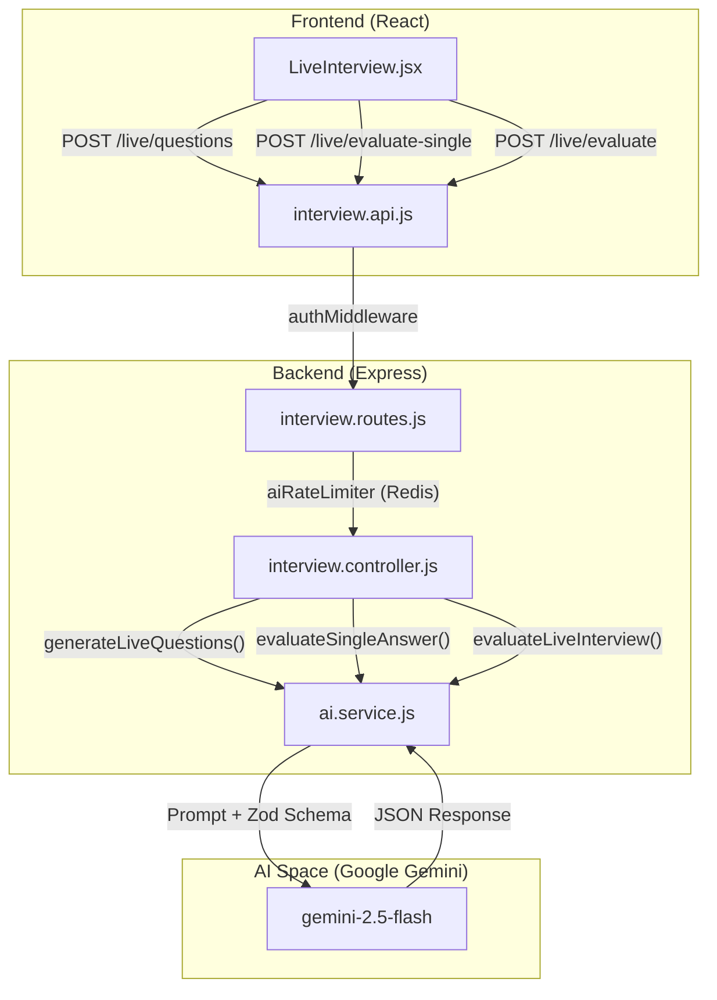
 
### Dynamic Roadmap Generation
 
The `generateDynamicRoadmap()` function provides users with a tailored, day-by-day preparation strategy:
 
- **Parameters**: `jobDescription`, `resumeText`, and `days` (custom duration).
- **Schema**: `dynamicRoadmapSchema` — enforces `preparationPlan` array with `day`, `focus`, and `tasks`.
- **Logic**: Day 1 focuses on fundamentals; the final day focuses on mock interviews or rest.
 
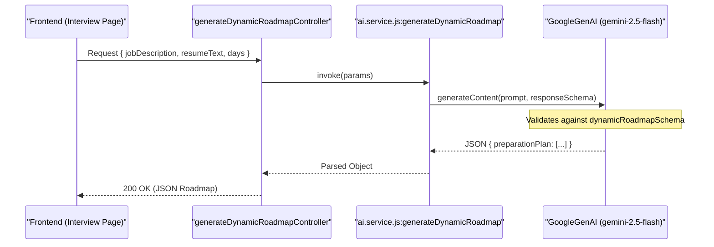
 
---
 
## Frontend Architecture
 
The HirePrep AI frontend is a modern Single Page Application (SPA) built with **React** and **Vite**. It utilizes a feature-based directory structure, centralized provider tree for global state, and a **glassmorphism** design system with SCSS.
 
### Application Bootstrap & Provider Tree
 
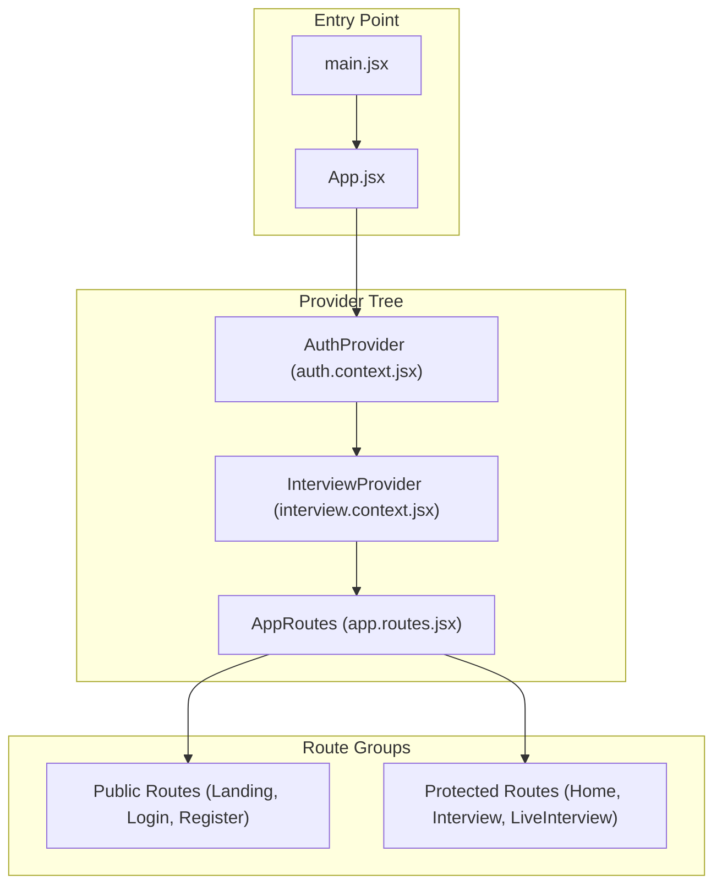
 
### Routing & Protected Routes
 
- **Public Routes**: Landing page (`/`), Login (`/login`), Register (`/register`).
- **Protected Routes**: Dashboard/Home (`/home`), Interview Report (`/interview/:id`), Live Interview (`/live-interview/:id`).
- The `ProtectedRoute` component wraps authenticated routes, redirecting unauthenticated users to the login page.
 
### Authentication Feature
 
The authentication feature uses React Context (`AuthProvider`) to manage user state across the application:
 
- **Login/Register** — Calls backend API, stores JWT in HTTP-only cookies, updates context.
- **Session Persistence** — On app load, `getMe()` is called to verify the existing cookie session.
- **Logout** — Calls backend to blacklist the token, clears cookie, resets context.
 
### Interview Feature — Dashboard & Report View
 
#### Dashboard (`Home.jsx`)
A three-input form where users provide:
1. **Job Description** (text)
2. **Self Description** (text)
3. **Resume** (PDF file upload)
 
Submitting triggers `generateReport()` from the `useInterview` hook.
 
#### Report View (`Interview.jsx`)
Displays the AI-generated analysis with a tabbed navigation system:
 
| Tab | Component | Description |
| :--- | :--- | :--- |
| `technical` | `QuestionCard` | AI-generated technical questions with expandable model answers |
| `behavioral` | `QuestionCard` | Behavioral questions focusing on soft skills |
| `roadmap` | `RoadMapDay` | Day-by-day preparation plan with custom regeneration |
| `jobs` | `JobSearchSection` | Live job search based on resume analysis |
 
The right-hand panel displays:
- **Match Score Ring** — SVG-based circular progress bar
- **Skill Gaps** — Tags categorized by severity (High, Medium, Low)
- **Resume Download** — Button to download AI-optimized resume PDF
 
### Live Interview Feature
 
The Live Interview Feature provides an immersive, real-time interview simulation using the Web Speech API and Google Gemini.
 
#### Three-Step Lifecycle
 
**Step 1: Command Center (Setup)**
- Displays detected skills and projects from the resume
- Users select interview type (Technical, Behavioral, Mixed)
- Optional custom instructions for the AI
 
**Step 2: Live Q&A Session**
- Questions delivered via Text-to-Speech (`window.speechSynthesis`)
- User responses captured via Speech-to-Text (`webkitSpeechRecognition`)
- Camera toggle with proper media stream lifecycle management
- Smart transcript accumulation with manual edit support
- Per-answer feedback available via "Submit for Feedback" button
 
**Step 3: Analytics Dashboard**
- Circular SVG score chart for `overallScore`
- Skills breakdown (confidence, communication, correctness)
- Per-question review with AI feedback
 
#### `useSpeech` Hook
- **TTS (`speak`)** — Uses `window.speechSynthesis` with callback to enable mic after AI stops talking.
- **STT (`startListening`)** — Uses `webkitSpeechRecognition` with `continuous: true` and `interimResults: true`.
- **Cleanup** — `useEffect` cleanup ensures microphone/speech synthesis is stopped on navigation.
 
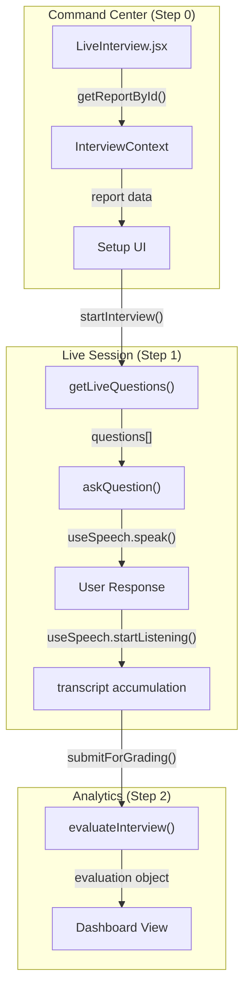
 
### Public Landing Page
 
The landing page serves as the primary entry point for unauthenticated users with a "glassmorphism" aesthetic.
 
**Page Sections:**
 
| Section | Key Elements |
| :--- | :--- |
| **Navbar** | Logo with `.text-gradient`, Login and Get Started buttons |
| **Hero** | AI feature badge, high-impact typography, primary CTA |
| **Social Proof** | Top tech company names for credibility |
| **Features Grid** | Five feature cards with animated SVG icons |
| **How It Works** | 4-step sequential guide |
| **Footer** | Product, Company, and Legal links |
 
**Design System:**
- `--bg-dark`: Base background (`#09090b`)
- `--glass-bg`: Semi-transparent white (`rgba(255, 255, 255, 0.03)`)
- `--accent-gradient`: Emerald gradient for primary actions
- `.glass-panel`: `backdrop-filter: blur(16px)` with subtle borders
- Responsive grid: `repeat(auto-fit, minmax(300px, 1fr))`
- Fluid typography: `clamp(3rem, 8vw, 5.5rem)` for hero titles
 
### Frontend API Service Layer
 
The Frontend API Service Layer provides a centralized, modular interface for communicating with the backend.
 
#### Axios Configuration
- **Base URL**: Defaults to `http://localhost:3000`, configurable via `VITE_API_URL`.
- **Credentials**: `withCredentials: true` ensures HTTP-only JWT cookies are included.
 
#### Data Handling Pipelines
 
| Pipeline | Use Case | Implementation |
| :--- | :--- | :--- |
| **JSON** (Default) | Standard CRUD, AI evaluations | Standard `axios.post/get` |
| **Multipart/Form-Data** | Resume upload + report generation | `FormData` API with explicit `Content-Type` header |
| **Blob** (Binary) | Resume PDF download | `responseType: 'blob'` |
 
#### Authentication Service Contracts (`auth.api.js`)
 
| Function | Endpoint | Method |
| :--- | :--- | :--- |
| `register` | `/api/auth/register` | POST |
| `login` | `/api/auth/login` | POST |
| `logout` | `/api/auth/logout` | POST |
| `getMe` | `/api/auth/get-me` | GET |
 
#### Interview & AI Service Contracts (`interview.api.js`)
 
| Function | Endpoint | Method | Pipeline |
| :--- | :--- | :--- | :--- |
| `generateInterviewReport` | `/api/interview/` | POST | Multipart/Form-Data |
| `getInterviewReportById` | `/api/interview/report/:id` | GET | JSON |
| `generateResumePdf` | `/api/interview/resume/pdf/:id` | POST | Blob |
| `getLiveQuestions` | `/api/interview/live/questions` | POST | JSON |
| `evaluateSingleAnswer` | `/api/interview/live/evaluate-single` | POST | JSON |
| `generateDynamicRoadmap` | `/api/interview/roadmap/dynamic` | POST | JSON |
 
#### Error Handling
 
The service layer follows a "Delegated Error Handling" pattern. Services include `try-catch` for logging, but UI response logic (alerts, redirects) is delegated to calling hooks/components.
 
---
 
## Data Models
 
HirePrep AI utilizes **MongoDB** via **Mongoose ODM** with two primary entities: users and interview reports.
 
### User Model
 
The `userModel` stores authentication and identity data:
 
| Field | Type | Constraints | Description |
| :--- | :--- | :--- | :--- |
| `username` | `String` | `required`, `unique` | Unique identifier chosen by the user |
| `email` | `String` | `required`, `unique` | Used for login and identification |
| `password` | `String` | `required` | Hashed representation (bcrypt, 10 salt rounds) |
 
The `unique` constraints automatically create MongoDB indexes for O(log n) lookup performance.
 
### InterviewReport Model
 
The `interviewReportModel` is the central data structure for AI features, using nested sub-schemas:
 
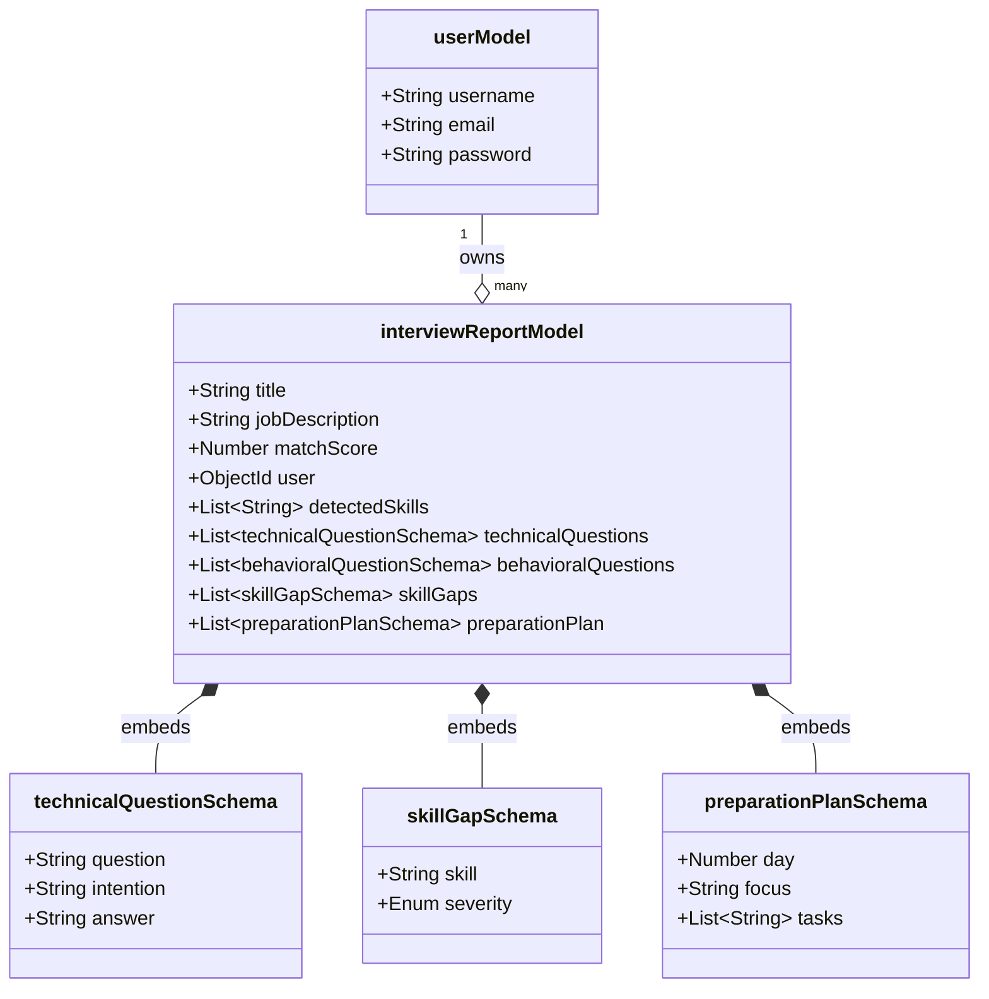
 
#### Top-Level Fields
 
| Field | Type | Description |
| :--- | :--- | :--- |
| `jobDescription` | String | Raw text of the target job posting (required) |
| `resume` | String | Text extracted from the uploaded PDF |
| `selfDescription` | String | Additional user-provided context |
| `matchScore` | Number | Value 0–100 representing job alignment |
| `detectedSkills` | Array\<String\> | Skills identified by AI in the resume |
| `identifiedProjects` | Array\<String\> | Key projects extracted from the resume |
| `title` | String | Job title for the report (required) |
| `user` | ObjectId | Reference to the `users` collection |
| `timestamps` | Boolean | Automatic `createdAt` and `updatedAt` |
 
#### Sub-Schemas
 
- **`technicalQuestionSchema`** — `question`, `intention`, `answer`
- **`behavioralQuestionSchema`** — `question`, `intention`, `answer`
- **`skillGapSchema`** — `skill`, `severity` (enum: `low`, `medium`, `high`)
- **`preparationPlanSchema`** — `day` (Number), `focus` (String), `tasks` (Array\<String\>)
 
All sub-schemas use `_id: false` to prevent unnecessary indexing.
 
---
 
## Security & Rate Limiting
 
HirePrep AI implements a multi-layered "Defense in Depth" security architecture:
 
### JWT Lifecycle
 
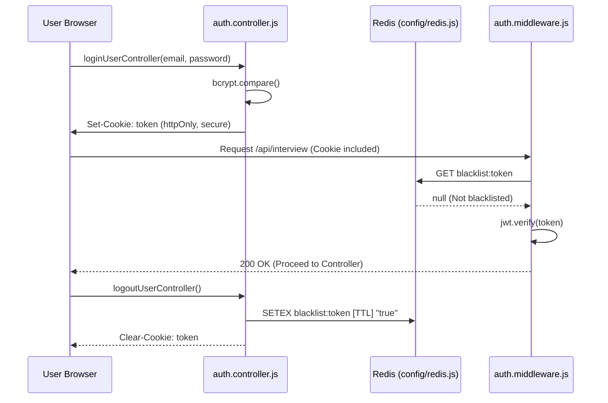
 
### Security Implementation Summary
 
| Mechanism | Code Entity | Purpose |
| :--- | :--- | :--- |
| **Password Hashing** | `bcrypt` in `auth.controller.js` | One-way encryption for user credentials |
| **Session Security** | `httpOnly`, `secure`, `sameSite` | Protects JWTs from XSS and CSRF |
| **Token Invalidation** | `blacklist:${token}` in Redis | Immediate logout capability |
| **IP Identification** | `trust proxy` in `app.js` | Accurate rate limiting behind proxies |
| **AI Quota Protection** | `aiRateLimiter` in `interview.routes.js` | Prevents Gemini API abuse (10 req/15 min) |
| **CORS Sanitization** | `frontendUrl.replace(/\/$/, "")` | Ensures strict origin matching |
| **File Validation** | `multer` in `file.middleware.js` | PDF-only, 5 MB max, in-memory storage |
 
### Rate Limiting Architecture
 
| Scope | Window | Limit | Endpoints |
| :--- | :--- | :--- | :--- |
| **Auth** | 15 minutes | 10 requests/IP | `/api/auth/register`, `/api/auth/login` |
| **AI** | 15 minutes | 10 requests/IP | All generative `/api/interview/*` endpoints |
 
Both use `express-rate-limit` with `rate-limit-redis` (RedisStore) for distributed state management.
 
---
 
## Troubleshooting
 
- **Redis Connection Refused** — Ensure the Redis server is running locally or that `REDIS_URL` is correct. The backend requires Redis for rate limiting even in development.
- **Puppeteer/Chromium Errors** — On some Linux environments, Puppeteer may require additional dependencies for the headless browser used in PDF generation.
- **CORS Issues** — Ensure `FRONTEND_URL` in the backend `.env` matches the Vite dev server URL (including the port).
- **PDF Parsing** — If resume text extraction fails, ensure the file is a valid PDF. The system uses `pdf-parse` to process the buffer.
- **`shm_size` Errors** — In Docker, if Chromium crashes during PDF rendering, increase `shm_size` in `docker-compose.yml` (default is `1gb`).
 
---
 
## Glossary
 
| Term | Definition |
| :--- | :--- |
| **ATS** | Applicant Tracking System. The resume generation logic optimizes for these systems. |
| **Bcrypt** | Hashing algorithm used to secure user passwords with 10 salt rounds. |
| **CORS** | Cross-Origin Resource Sharing. Configured to allow the Vercel frontend to communicate with the Docker backend. |
| **Fingerprinting** | SHA-256 hash of input data used as a Redis cache key to prevent redundant AI calls. |
| **JWT** | JSON Web Token. Used for stateless authentication, stored in `httpOnly` cookies. |
| **Glassmorphism** | The UI design system using semi-transparent panels with `backdrop-filter: blur()`. |
| **Puppeteer** | Headless browser library used to render AI-generated HTML into downloadable PDFs. |
| **STT** | Speech-to-Text. Powered by the Web Speech API via the `useSpeech` hook with `continuous` mode. |
| **Trust Proxy** | Express setting to trust `X-Forwarded-For` headers from load balancers for accurate rate limiting. |
| **TTS** | Text-to-Speech. Uses `window.speechSynthesis` to read questions and feedback aloud. |
| **TTL** | Time To Live. Used for Redis cache expiration (24 hours for reports, variable for blacklisted tokens). |
| **Zod** | Schema validation library ensuring predictable AI response structures from Gemini. |
 
---
 
## License
 
This project is open source. See the repository for license details.
